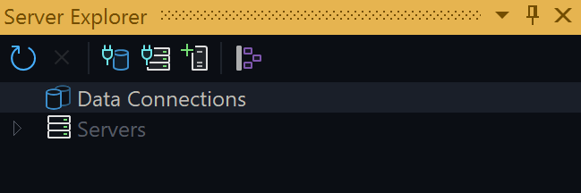
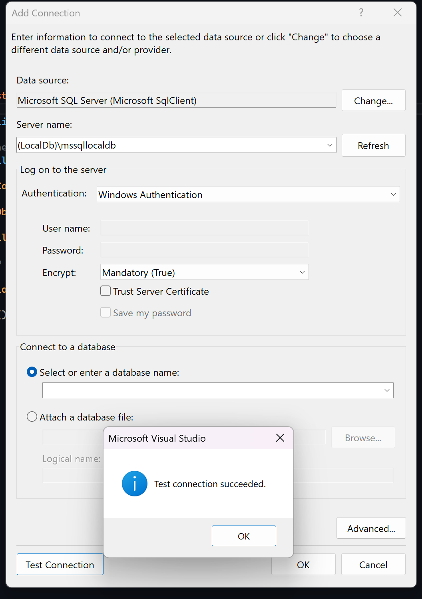
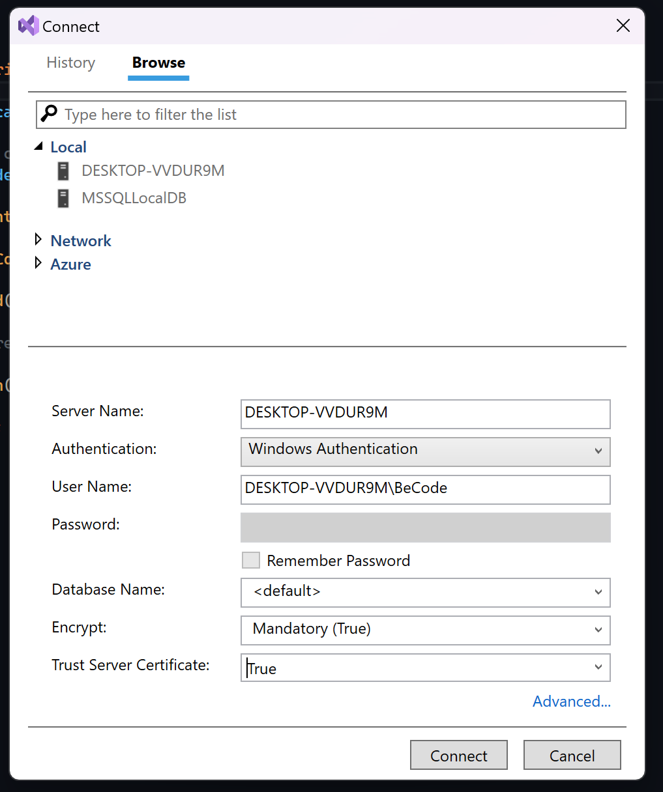
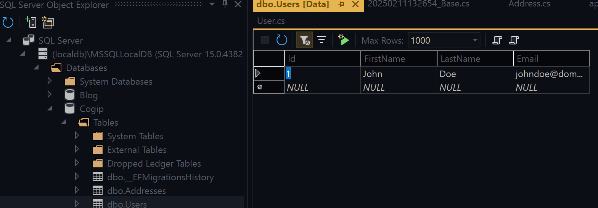
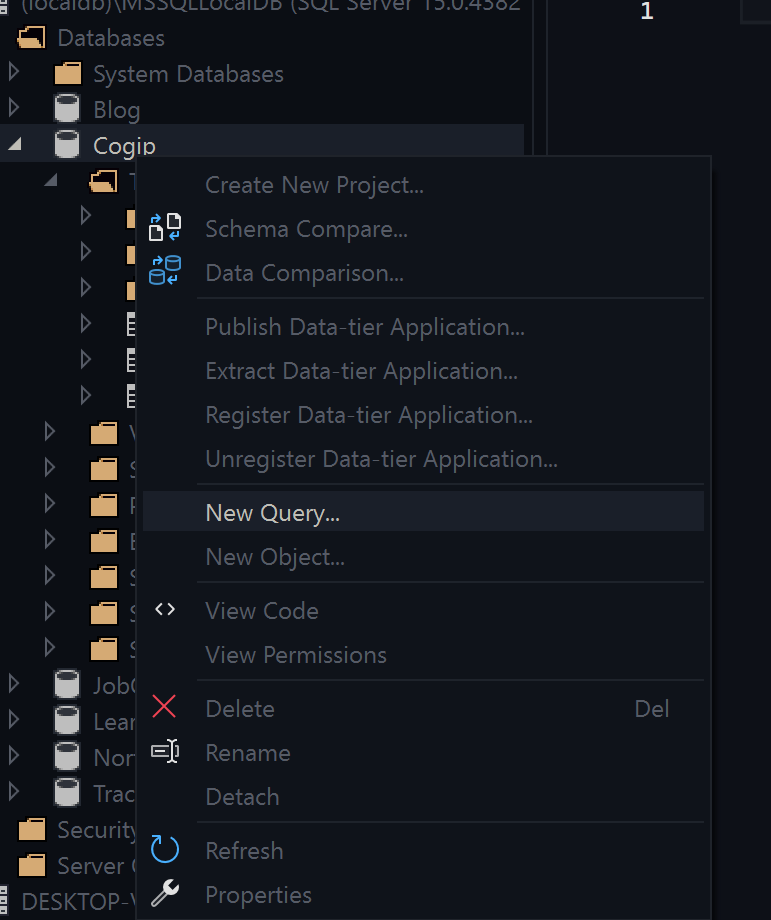

# 21.ASP.NET : Seeds

## 1. What are Seeds in ASP.NET Core?
Seeds in `ASP.NET Core` refer to initial data that is automatically inserted into the database when it is created or updated. They help prepopulate certain tables with default values, which is useful for testing, configurations, or essential data required for the application to function properly.

## 2. Why Use Seeding?
- Ensures the presence of essential data at application startup.
- Simplifies development and testing by prepopulating the database.
- Prevents an empty database after a migration.

## 3. Implementing Seeding with Entity Framework Core
In **Entity Framework Core**, seeding data is typically done in the DbContext class using the **OnModelCreating** method. This allows us to define default data that will be inserted when the database is created or updated through migrations.

### Conditional Seeding Based on Environment
Sometimes, you may want to apply seed data only in specific environments, such as `development`, but exclude it in `production`. You can achieve this by checking the application's environment variables before applying the seed data.

### Example: Seeding Data Only in Development
Below is an example where the seed data is only applied when the application is running in the Development environment:

```csharp
protected override void OnModelCreating(ModelBuilder modelBuilder)
{
    base.OnModelCreating(modelBuilder);

    if (Environment.GetEnvironmentVariable("ASPNETCORE_ENVIRONMENT") == "Development")
    {
        modelBuilder.Entity<User>().HasData(
            new User
            {
                Id = 1, // Ensure IDs are provided for seeding
                FirstName = "John",
                LastName = "Doe",
                Email = "johndoe@domain.be"
            }
        );
    }
}
``` 

### Understanding the Environment Variable
The line:

``` Environment.GetEnvironmentVariable("ASPNETCORE_ENVIRONMENT")```

retrieves the current environment setting of the application. Possible values include:

- **Development** : Typically used for local development and testing.
- **Staging** : Used for pre-production testing.
- **Production**:  The live production environment.

By adding this condition, we ensure that the seed data is only applied when the application runs in Development, preventing unnecessary data from being inserted in Production.

### Managing Environment Settings
To manage your environment configurations, navigate to:

```📂 Properties > 📄 launchSettings.json```

This file contains different environment profiles for running the application.

### Execute

- In your PMC, type : **update-database**
- In your terminal, type : **dotnet ef database update**

## 4. Seeding Through a SQL File
In addition to using `Entity Framework` Core for data seeding, you can also execute a raw **.sql** file to populate your database directly. 

This approach is useful when working with existing databases, complex data structures, or when managing large datasets.

```sql
print 'Table Users' 
INSERT INTO Users (Firstname,Lastname,Email) values 
('John','Doe','johndoe@domain.be'),
('Justine','Mayer','justinemayer@domain.be')
go
```

### Saving the SQL File
Save the script as seed_data.sql inside your project, e.g., in a `Database` or `Scripts` folder.

## 5. Find my database in Visual Studio?

### 1. Go to  `View > Server Explorer`



### 2. Add a connection


For the `Server name`, please enter **(LocalDb)\mssqllocaldb**. 

### 3. Go to `View > SQL Server Object Explorer` and add a `SQL Server` 


- Choose `Local > MSSQLLocalDB`
- Trust Server Certificate : true

### 6. You're now ready


From there, you can now create your own `sql` queries

